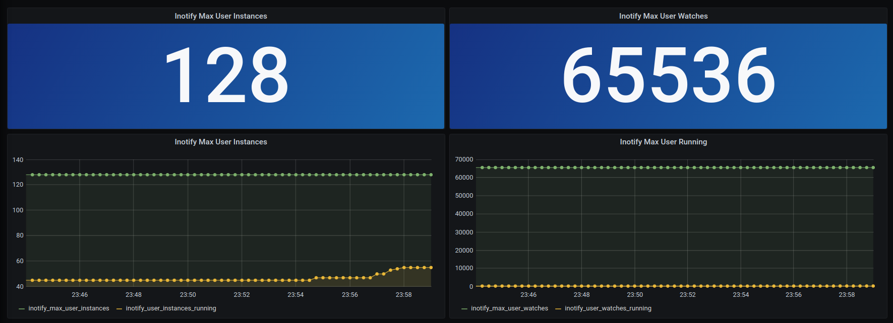

# Inotify-Exporter
It's increasingly common for programs to use Linux's inotify to watch files. Some apps leak the file descriptors of the inotify watches. When that happens, the machine will eventually run out of inotify watches.

It would be useful to have a metric with the number of inotify watches to be able to monitor it.

# Try it
```
inotify-exporter -Port 2110 (default port 2110 - /metrics )
```
# Grafana Dashboard 



Example metrics output:
```
# HELP inotify_max_user_instances Maximum Number of inotify instances
# TYPE inotify_max_user_instances gauge
inotify_max_user_instances 128
# HELP inotify_max_user_watches Maximum Number of inotify watches
# TYPE inotify_max_user_watches gauge
inotify_max_user_watches 65536
# HELP inotify_user_instances_running The Number of running inotify instances
# TYPE inotify_user_instances_running gauge
inotify_user_instances_running 45
# HELP inotify_user_watches_running The Number of Running inotify watches
# TYPE inotify_user_watches_running gauge
inotify_user_watches_running 295
```
